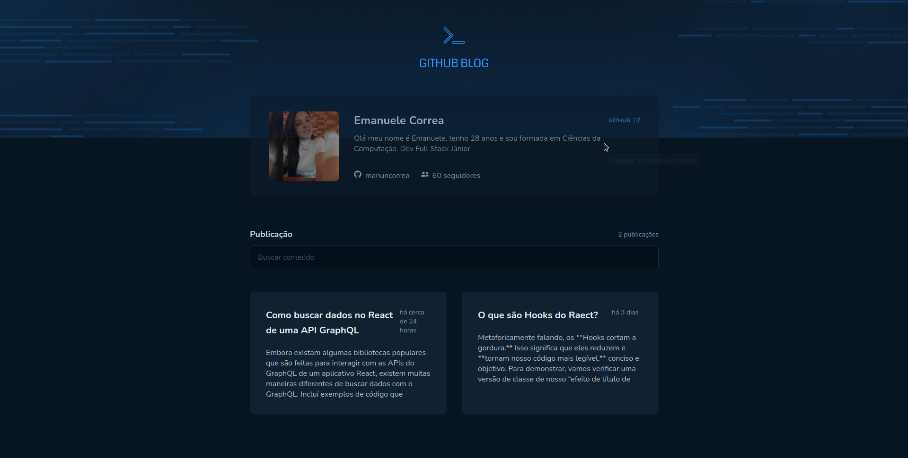

## GITHUB - BLOG



```bash
# Clonar repositorios
$ git clone https://github.com/manuncorrea/github-blog

# Go into the repository
$ cd github-blog

# Instale dependências 
$ npm install

#Inicinado o projeto
$ npm run dev

```